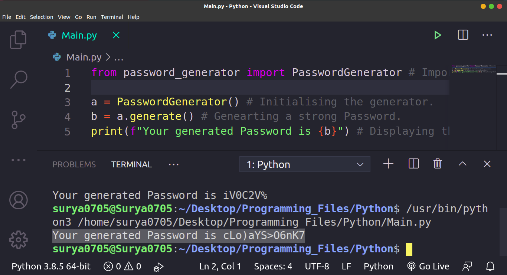

# Python_Random_Password_Generator
This is a Python Program that generates random strong Passwords. It uses a module for this purpose. To install that Module just type the following in your CMD/Powershell/Terminal (Assuming that You are on Windows):
```
pip install random-password-generator
```
Or if you are in Linux(Ubuntu 20.04 LTS which I am using) then use:
```
pip3 install random-password-generator
```
Or install according to your OS. After installation just run the (Main.py)[Main.py] file and you'll get your generated Password. Below is the Screenshot of My Program:

Hope that you Liked it!
